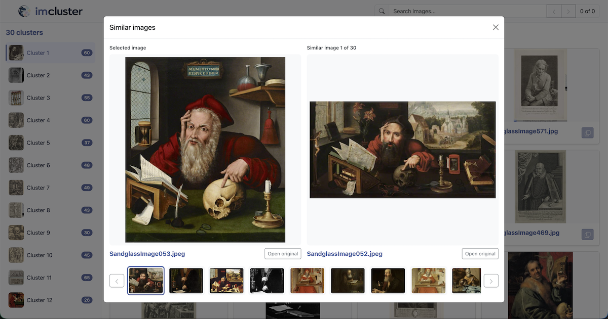

=====
Usage
=====

Basic run
=========

.. code-block:: bash

   imcluster photos/

Pass ``--recursive`` to search nested directories. Inputs may also be image
paths or text manifests containing one image path per line.

The gallery opens in the default browser. Use ``--no-open`` to suppress this,
``--gallery PATH`` to preserve the HTML report, and ``--cache PATH`` to retain
the processing cache. Without those paths, temporary outputs are used.

Explore similar images
======================

Click any image card in the gallery to open a comparison modal. The selected
image remains on the left, while the right side shows one of its 30 nearest
visual neighbours. These neighbours are ranked by cosine similarity between
the original model feature vectors. The thumbnail strip and previous/next
buttons move through the ranked matches.

Click the similar image on the right to make it the new selected image. The
modal rebuilds the comparison using that image's own nearest neighbours, so
you can continue exploring without closing it.

Full-resolution images are loaded from their original file paths. If a source
file is unavailable, the modal uses its embedded thumbnail instead. Thumbnail
data is embedded only once in the standalone HTML and reused with JavaScript.

Caching
=======

The Parquet file selected by ``--cache`` caches expensive stages. It can be
reused only with the same ordered set of resolved image paths. Use ``--force``
to replace it, or a stage-specific force option to recompute part of the
pipeline.

Once a cache exists, its stored image paths can be used without repeating the
original inputs:

.. code-block:: bash

   imcluster --cache results.parquet

Clustering
==========

K-means is the default clustering method. Spectral, K-means, agglomerative,
and hierarchical clustering use ``--n-clusters``. DBSCAN uses
``--dbscan-eps``; DBSCAN and HDBSCAN share ``--min-samples`` and report
outliers as noise.

Dimensionality reduction
========================

By default, UMAP reduces the DINO feature vectors before clustering. PCA and
t-SNE can be selected instead, or reduction can be disabled:

.. code-block:: bash

   imcluster photos/ --reduce umap
   imcluster photos/ --reduce tsne
   imcluster photos/ --reduce pca
   imcluster photos/ --reduce none

Use ``--reduction-dims`` to change the default target of 50 dimensions:

.. code-block:: bash

   imcluster photos/ --reduce umap --reduction-dims 25

PCA and t-SNE use scikit-learn. UMAP uses umap-learn. The reduced vectors are
cached, and changing the reduction method or requested dimensions recomputes
cluster assignments. UMAP requires at least three images. t-SNE is capped at
three output dimensions.

Cluster names
=============

Add ``--name`` to generate concise descriptive names with a multimodal LLM:

.. code-block:: bash

   export OPENAI_API_KEY=your-api-key
   imcluster photos/ --name --llm gpt-5.6-luna

For each cluster, imcluster chooses a cosine medoid and then diverse examples
using farthest-first traversal. By default, no images from outside the cluster
are sent and the prompt only describes the in-cluster examples. The Python API
can request nearby outside images as contrasting examples by setting
``out_group_size`` above zero. Only JPEG thumbnails already stored in the cache
are sent to the LLM; source image files are not included in the prompt.

Names are stored in an algorithm-specific cache column and appear in the
gallery sidebar and headings. Numeric cluster assignments remain unchanged,
so naming does not affect evaluation. Cached names are reused unless the
clusters are recomputed or ``--force`` is supplied. Noise produced by DBSCAN or
HDBSCAN retains the name ``Noise`` without making an LLM request.

The default naming model is ``gpt-5.6-luna`` with temperature ``0.2``. Select a
different llmloader-compatible multimodal model with ``--llm`` and adjust
sampling with ``--llm-temperature``. ``--llm-api-key`` is available, but the
provider's environment variable is preferable because command-line secrets can
be retained in shell history and process listings.

Evaluation
==========

Evaluate cluster assignments against expected classes with a CSV containing
``filename`` and ``class`` columns:

.. code-block:: text

   filename,class
   airplane-01.jpg,airplane
   airplane-02.jpg,airplane
   forest-01.jpg,forest

Then pass it to the CLI:

.. code-block:: bash

   imcluster photos/ --evaluate expected_classes.csv

The class values may be any consistent names. imcluster reports Normalized
Mutual Information (NMI), Adjusted Rand Index (ARI), and clustering accuracy
(ACC). ACC optimally matches numeric cluster IDs to expected classes, so the
specific cluster numbers do not affect the score.

Save the scores as a one-row CSV with ``NMI``, ``ARI``, and ``ACC`` columns:

.. code-block:: bash

   imcluster photos/ --evaluate expected_classes.csv --metric metrics.csv
